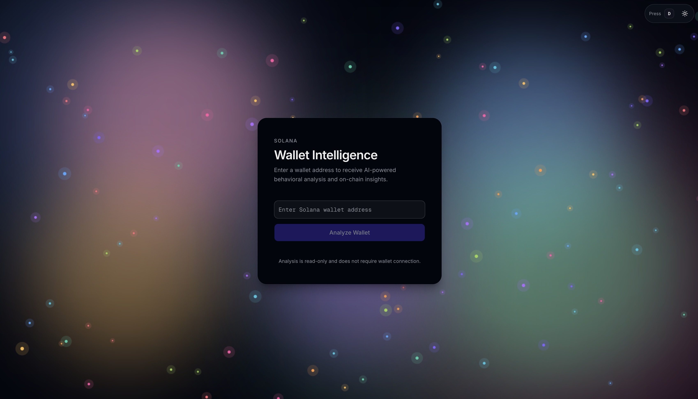
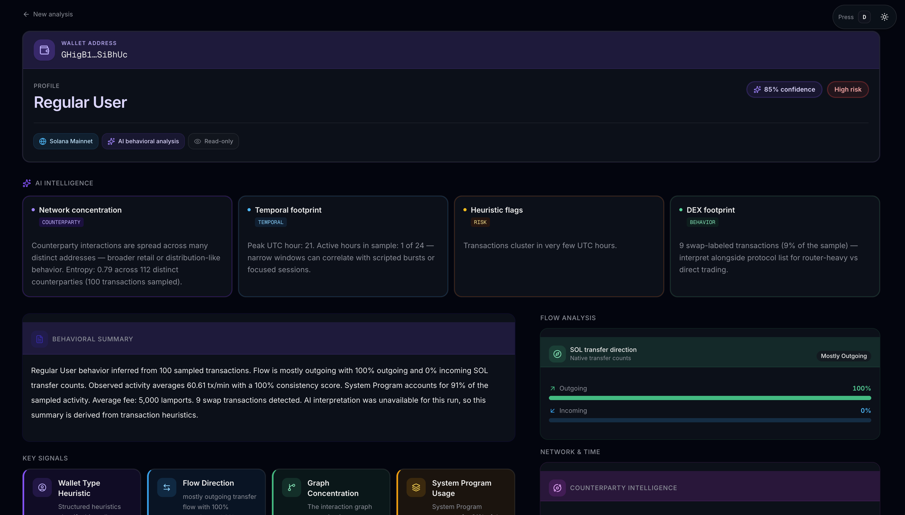

# Wallet Intelligence

**AI-assisted behavioral intelligence for Solana wallets** — paste an address, pull on-chain activity, and get a readable profile with metrics, flow, and narrative insights. **SolRouter** (via `@solrouter/sdk`) is the AI gateway: their platform describes it as **the first cryptographically private AI platform**, powered by **Arcium** and **OpenServ** — i.e. private-by-design routing for the prompts and structured analytics you send to the model, not a generic always-plaintext pipe.

## Why this exists

Raw Solana transaction history is noisy and hard to interpret at a glance. Explorers show events; they do not easily answer “what kind of wallet is this?” or “what patterns stand out?” **Wallet Intelligence** bridges that gap: it fetches enhanced transactions, compresses them into structured analytics, and layers **deterministic charts and summaries** with **LLM-written narrative** so patterns, risk posture, and notable signals are understandable without digging through logs — with the model step going through **SolRouter**’s privacy-oriented stack.

## How AI is used

The app does **not** hallucinate chain data. **Helius** supplies transactions; the server builds a **structured feature payload** (graph metrics, counterparties, temporal patterns, protocols, anomaly hints, and more). That JSON is sent to a model through **SolRouter** (`@solrouter/sdk`) — the same **cryptographically private** Arcium / OpenServ-backed path summarized in the intro, instead of a generic API. A strict prompt requires the model to **ground claims in the numbers**, return **JSON only** (profile, behavior summary, insight cards, anomalies, soft forecasts, risk/confidence), and avoid price or identity claims. The UI merges that output with **rule-based fallbacks** when parsing or the API fails, so the dashboard stays useful either way.

## Screens

| Home — address input & analysis flow | Results — intelligence dashboard |
| :---: | :---: |
|  |  |

## What you get

- **Streaming analysis** — NDJSON steps from fetch → compress → build model input → AI.
- **Summary & AI insights** — profile label, behavioral summary, insight cards, anomalies, non-financial forecasts.
- **On-chain analytics** — signals, activity timeline, flow, graph intelligence, metrics, protocol and token usage.

## Tools & stack

| Area | Choice |
|------|--------|
| Tooling | **Bun** (install & scripts) |
| Framework | **Next.js** 16 (App Router, Node runtime for API) |
| UI | **React** 19, **Tailwind CSS** 4, **shadcn/ui**, **Radix UI**, **Base UI** |
| Motion | **Framer Motion** / **motion** |
| Icons | **Lucide React**, **Tabler Icons** |
| Data | **Helius SDK** (enhanced transactions) |
| AI routing | **SolRouter SDK** — private AI routing (Arcium & OpenServ); configurable models, default `gpt-oss-20b` |
| Language | **TypeScript** |
| Quality | **ESLint**, **Prettier** (+ Tailwind plugin) |

## Setup

1. Clone and install: `bun install`
2. Copy `.env.example` → `.env` and set:
   - **`HELIUS_API_KEY`** (or `NEXT_PUBLIC_HELIUS_API_KEY` / `API_KEY` — see `services/utils/util.ts`)
   - **`SOLROUTER_API_KEY`** (or `NEXT_PUBLIC_SOLROUTER_API_KEY`)
3. Run: `bun run dev` (Turbopack)

Scripts: `bun run build`, `bun run start`, `bun run lint`, `bun run typecheck`, `bun run format`.

---

*Crafted with curiosity and care — **built with love by Shouvik Mohanta**.*
